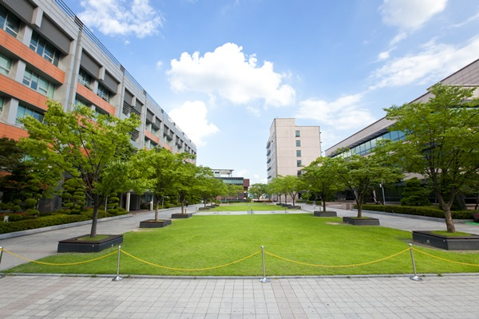

# helloworld
## sub title
### subsub title

# 나의 소개
안녕하세요. 동미입니다.
  

# 나의 동아리 소개

# 내가 들은 과목
[파이썬 프로그래밍](https://www.python.org)

자바 프로그래밍

# 공모전 수상현황
전국 대학생 IT 아이디어 대회
[대상 수상작 발표자료](/presentation.pptx)

# 동영상
<iframe width="1280" height="720" src="https://www.youtube.com/embed/0BsgC3pb_X0" title="동미대 캠퍼스 랜선투어 1편, 캠퍼스 이용 꿀팁 모음.zip🚩" frameborder="0" allow="accelerometer; autoplay; clipboard-write; encrypted-media; gyroscope; picture-in-picture; web-share" allowfullscreen></iframe>
